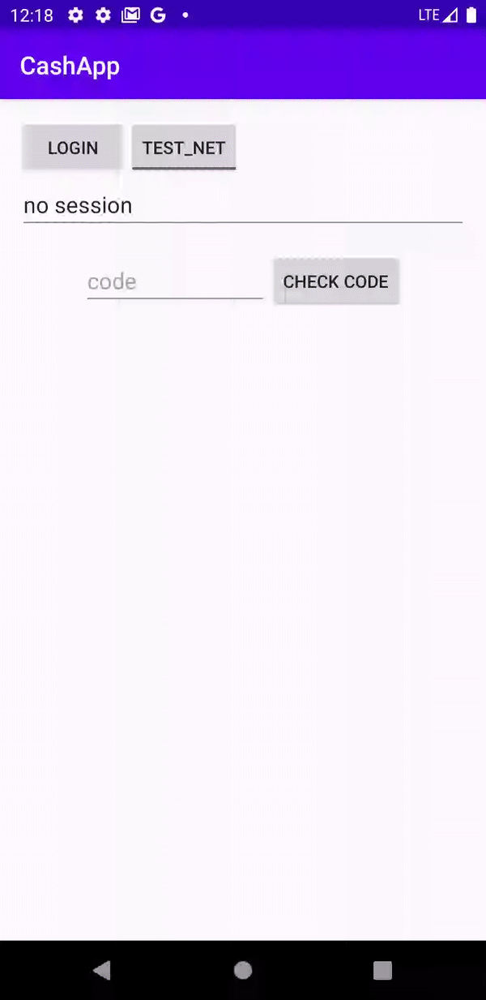

# cash-sdk-android
SDK to convert Crypto to Cash direct at thousands of ATMs

[](https://circleci.com/gh/atmcoin/cash-sdk-android)
[](https://jitpack.io/#atmcoin/cash-sdk-android)

### JacocoReport


### Sonar Status in `master` branch
[](https://sonarcloud.io/dashboard?id=atmcoin_atmcoin_cash-sdk-android) 
[](https://sonarcloud.io/component_measures/metric/coverage/list?id=atmcoin_atmcoin_cash-sdk-android)
[](https://sonarcloud.io/component_measures/metric/reliability_rating/list?id=atmcoin_atmcoin_cash-sdk-android)
[](https://sonarcloud.io/component_measures/metric/security_rating/list?id=atmcoin_atmcoin_cash-sdk-android)

Are you looking for the ios version of the CashSDK? 

https://github.com/atmcoin/cash-sdk-ios/

To setup the gradle dependency add to the master pom file the jitpack maven server.

```
allprojects {
  repositories {
    ...
    maven { url 'https://jitpack.io' }
  }
}
```

Then in the module that you want to use that dependency add the following implementation, change Tag to one of the releases for example
`com.github.atmcoin:cash-sdk-android:1.3`

```
dependencies {
  implementation 'com.github.atmcoin:cash-sdk-android:Tag'
}
```

In the module `app` you can find a demo app that shows how to use the CashSDK.


<p align="center">
  
</p>

